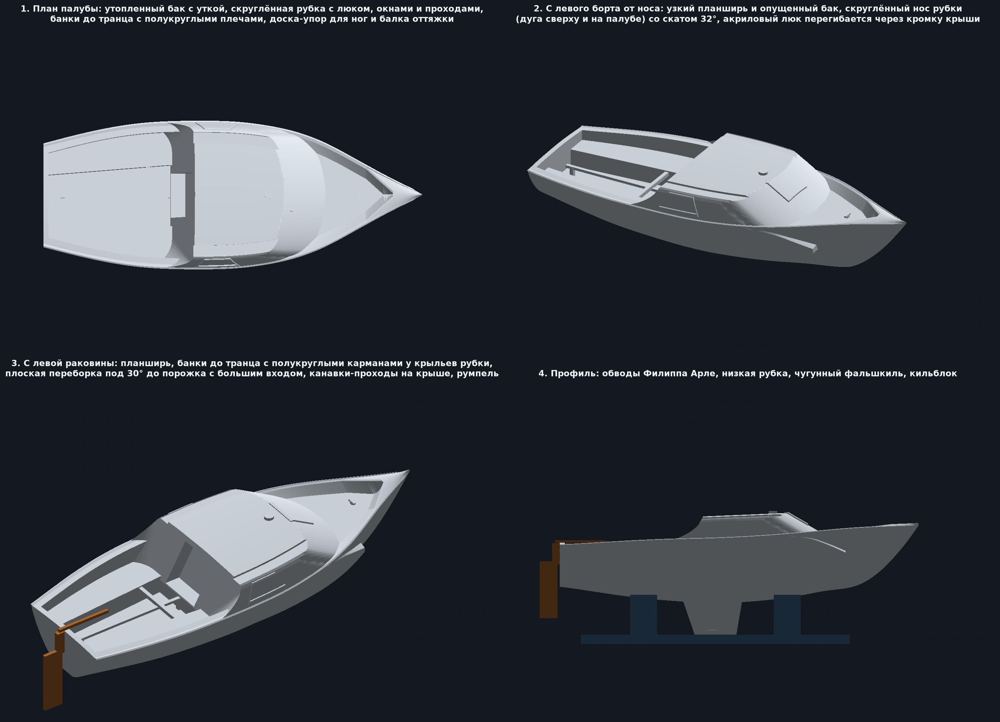

# ⛵ Jouët Sheriff 600 — Высокоточная 3D модель для печати

Параметрическая 3D-модель классической французской парусной яхты **Jouët Sheriff 600** (конструктор — **Philippe Harlé**, верфь — **Yachting France**, 1969–1976 гг.), созданная по оригинальным чертежам теоретического чертежа (Lines Plan) из журнала *Bateaux* (октябрь 1969 и июль 1973), официальной документации верфи и архивным фотографиям.

Модель полностью твердотельная (100% Watertight 2-manifold) и оптимизирована для FDM 3D-принтера **Flashforge Adventurer 3** (область печати 150 × 150 × 150 мм) в масштабе **1:45**, а также экспортирована в масштабе **1:1**.



---

## 📐 Характеристики прототипа (Jouët Sheriff 600)

- **Длина наибольшая (LOA):** 6.00 м (6000 мм)
- **Длина по КВЛ (LWL):** 5.00 м (5000 мм)
- **Ширина наибольшая (Bmax):** 2.31 м (2310 мм)
- **Осадка (Draft):** 0.85 м (чугунный фальшкиль)
- **Высота надводного борта:** нос — 980 мм, мидель — 760 мм, транец — 650 мм
- **Водоизмещение:** ~850 кг (балласт 300 кг)
- **Материал оригинала:** Стеклопластик (GRP)

---

## 🧩 Особенности геометрии версии V4 (палуба по фотографиям реальной лодки)

Подводная часть, обводы, транец, фальшкиль и стыковочные пазы киля не менялись с V3. Палуба, рубка и кокпит построены заново по фотографиям из `real_photos/`:

1. **Утопленный бак.** Узкий планширь (50 мм) остаётся на уровне борта и чуть наклонён внутрь, дальше скос 150 мм вниз к опущенной палубе: у рубки она ниже на 70 мм, к носу — на 160 мм; к штевню углубление сходится клином. Посередине бака — маленькая **швартовая утка поперёк лодки**.
2. **Рубка во всю ширину:** боковые стенки — плоские, поднимаются прямо от кромки борта (привального бруса), повторяя его обводы, наклонены внутрь на 20°; крыша почти плоская, кормовые углы острые. Вдоль обоих краёв крыши от кормовой кромки до самого её конца (канавка выбегает на скат и заканчивается ровно на дуге перегиба) идут **проходы-канавки** (220 мм, глубина 20 мм); ободок снаружи от канавки **трапециевидный**: внешняя грань — продолжение стенки, плоский верх 30 мм, скос 45° в канавку. По одному **трапециевидному окну** на борт (700/410 × 250 мм) целиком на стенке: верх и низ параллельны линии края крыши (45 мм от неё), наклонные рёбра параллельны кормовой переборке; приподнятая алюминиевая рамка и утопленное тонированное стекло.
3. **Скруглённый нос рубки:** плоская крыша впереди заканчивается полуэллипсом (400 мм вперёд по ДП), и от этой дуги передняя грань падает вперёд под 32° — поэтому и перегиб на крыше, и линия подножия на баке являются дугами, а углы к боковым стенкам плавно сглажены. На скате вверху — **люк из тонированного акрила** (плоская пластина без рамки), его задний край на ~50 мм перегибается через кромку на крышу. Мачта стоит на крыше чуть позади перегиба.
4. **Кормовая переборка** — одна плоскость, наклонённая вперёд на 30° (параллельно заднему ребру окна), спускается на 50 мм ниже уровня банок до порожка (Z 450, банки Z 500) и поднимается до крыши. По бортам от неё рубка выступает назад вдоль бортов «крыльями», которые заканчиваются **вогнутыми четвертями окружности** (центр дуги в кокпите): дуга начинается касательно к линии борта на уровне палубы и подходит к переборке касательно, так что каждая банка упирается в полукруглую стенку без срезанных углов. Радиус 450 мм на уровне банок и линейно сходит на ноль к крыше, так что скруглённая стенка плавно превращается в плоскую стенку рубки, а углы крыши остаются острыми. В переборке **большой вход в рубку** — проём 700 мм от порожка почти до крыши, выполненный карманом глубиной 200 мм.
5. **Открытый кокпит:** плоская полоса планширя по борту (150 мм), упирающаяся в крылья рубки, ниже — банки, между ними углублённый пол; банки и пол идут до самого транца (кормовой банки нет, рундука нет). Банки заканчиваются полукруглыми карманами у крыльев рубки.
6. **Доска-упор для ног, стойки и балка оттяжки гика** в полу кокпита: доска 55 мм шириной лежит плашмя вдоль почти всего пола на двух стойках у его концов, поперечная балка между банками проходит над ней. Сечения увеличены до ~1,3 мм в масштабе ради печатаемости.
7. **Транец, навесной руль и румпель:** транец сплошной, перо руля навешивается снаружи, румпель проходит над транцем.
8. **Все плоские поверхности — точные плоскости:** рубка и кокпит собраны булевыми операциями (`manifold3d`), а не деформацией сетки корпуса, поэтому скат, крыша, банки, пол и переборка не имеют волн и ступенек.

---

## 📂 Файлы в репозитории (`stl_output/`)

### Масштаб 1:45 (Для Flashforge Adventurer 3, 150×150×150 мм)

| Файл | Назначение | Размеры (X × Y × Z, мм) | Особенности печати |
| :--- | :--- | :--- | :--- |
| **`Jouet_Sheriff_Waterline_1to45.stl`** | Ватерлинейная модель (только надводная часть: борта, палуба, рубка, кокпит) | 133.3 × 52.3 × 26.8 | **Печать БЕЗ поддержек**. Ложится плоским дном по КВЛ прямо на стол. ~22 г PLA, ~3 часа. |
| **`Jouet_Sheriff_Split_Keel_1to45.stl`** | Нижняя половина (днище и фальшкиль с балластом) | 111.9 × 29.2 × 19.0 | **Печать БЕЗ поддержек**. Верх плоский (Z=0), класть срезом на стол. Внутри 2 паза под штифты. ~4.5 г PLA, ~45 мин. |
| **`Jouet_Sheriff_Split_Deck_1to45.stl`** | Верхняя половина (палуба, рубка, кокпит под склейку с килем) | 133.3 × 52.3 × 26.8 | **Печать БЕЗ поддержек**. Внизу 2 паза под штифты. ~22 г PLA, ~3 часа. |
| **`Jouet_Sheriff_Full_1to45.stl`** | Монолитная модель (корпус с килем целиком) | 133.3 × 52.3 × 45.8 | Требуются древовидные поддержки под скулы корпуса. |
| **`Jouet_Sheriff_Rudder_1to45.stl`** | Навесной руль с румпелем и петлями транца | 24.6 × 1.7 × 29.1 | Печатать плашмя. ~0.3 г PLA, ~15 мин. |
| **`Jouet_Sheriff_Display_Cradle_1to45.stl`** | Настольный кильблок-подставка под обводы днища | 100.0 × 48.9 × 18.3 | **Печать БЕЗ поддержек**. |
| **`Jouet_Sheriff_Rigging_1to45.stl`** | Рангоут (мачта 151 мм, гик, краспицы) | 61.0 × 21.1 × 151.1 | Печать по диагонали стола Adventurer 3 (диагональ 212 мм). |
| **`Jouet_Sheriff_Assembly_Preview.obj`** | 3D-сцена сборки (лодка + кильблок + руль) | — | Для открытия в 3D-просмотрщике или слайсере. |

### Полноразмерные модели (Масштаб 1:1, LOA = 6000 мм)
- **`Jouet_Sheriff_Full_1to1.stl`** (6000 × 2354 × 2060 мм)
- **`Jouet_Sheriff_Waterline_1to1.stl`** (6000 × 2354 × 1205 мм)

---

## 🖨️ Рекомендации по печати на Flashforge Adventurer 3

1. **Слайсер:** FlashPrint (или Cura / OrcaSlicer с профилем Adventurer 3).
2. **Материал:** PLA (белый для палубы/корпуса, коричневый/серый для руля и кильблока).
3. **Высота слоя:** `0.18 мм` (стандарт) или `0.12 мм` (высокая детализация).
4. **Стенки (Shells):** 2 периметра (0.8 мм).
5. **Заполнение (Infill):** 15% (Gyroid или Hexagon).
6. **Сборка разборной модели (`Split_Deck` + `Split_Keel`):**
   - Обе детали имеют ответные отверстия диаметром ~2.4 мм на плоскости ватерлинии: в киле глубиной 4 мм, в палубе — 2.9 мм (над кормовым отверстием лежит пол кокпита).
   - Отрежьте два кусочка обычного прутка PLA 1.75 мм длиной по 6–6.5 мм.
   - Вставьте их в отверстия в качестве центровочных штифтов и соедините половинки на каплю цианакрилатного клея (суперклея).

---

## 🛠️ Структура скриптов и генерация

- **`generate_sheriff_models.py`** — Главный генератор всех STL и OBJ моделей.
  - Корпус: сплайны по 13 шпангоутам, непрерывные замкнутые шпангоутные кольца (Ring Topology) с плоской палубой.
  - Рубка, кокпит, окна, люк, утка, рундук и стойки — отдельные тела, объединённые/вырезанные через `manifold3d`. Все размеры палубы вынесены в блок параметров в начале файла.
- **`render_v3_clean.py`** — Рендер предпросмотра (4 ракурса): собственный ортографический z-buffer-растеризатор с диффузным освещением. Не используйте `Poly3DCollection` из mplot3d — он сортирует полигоны по центрам и на длинных треугольниках после CSG рисует ложные «рваные» полосы.
- **`real_photos/`** — Фотографии конкретной лодки, главный ориентир для палубы.
- **`chez_downloads/`** и **`extracted_pdf_assets/`** — Исходные материалы, PDF выпусков журнала *Bateaux* и извлеченные сканы чертежей.

### Установка и запуск:
```bash
python3 -m venv .venv
.venv/bin/pip install numpy scipy trimesh manifold3d matplotlib networkx rtree shapely pillow
.venv/bin/python generate_sheriff_models.py
.venv/bin/python render_v3_clean.py
```

---

## 📌 Инструкции для разработчиков и AI-агентов

Если вы дорабатываете проект с помощью AI-агента (Cursor, Claude, Copilot, Antigravity), обязательно ознакомьтесь с файлом [AGENTS.md](AGENTS.md) — там описана математическая модель, правила сохранения водонепроницаемости сетки и план модификации палубной части по индивидуальным замерам.
